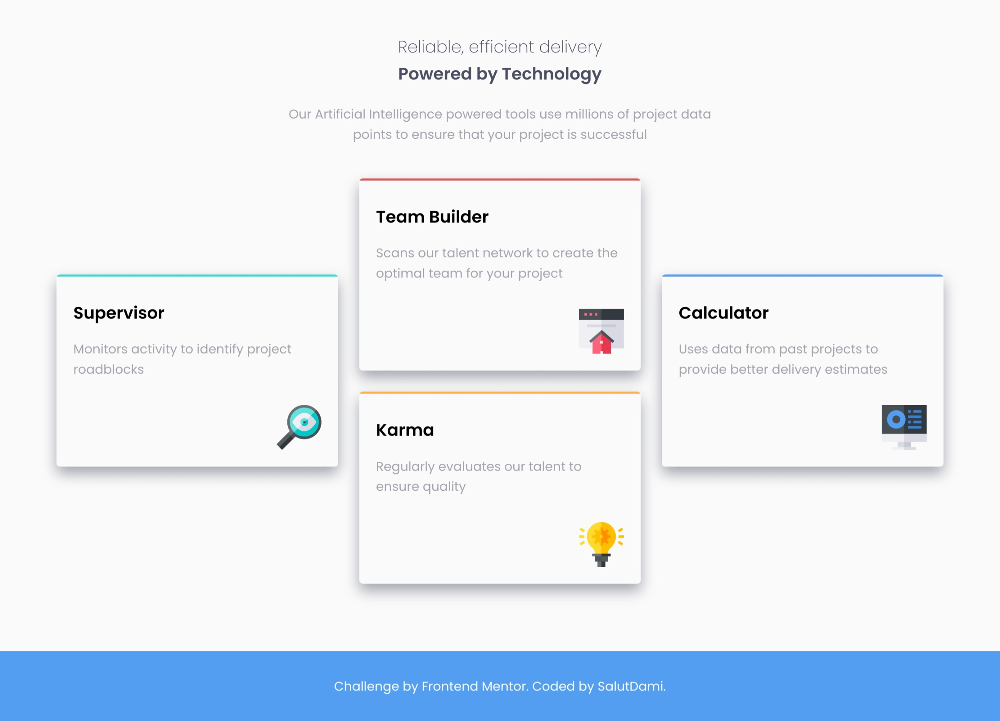
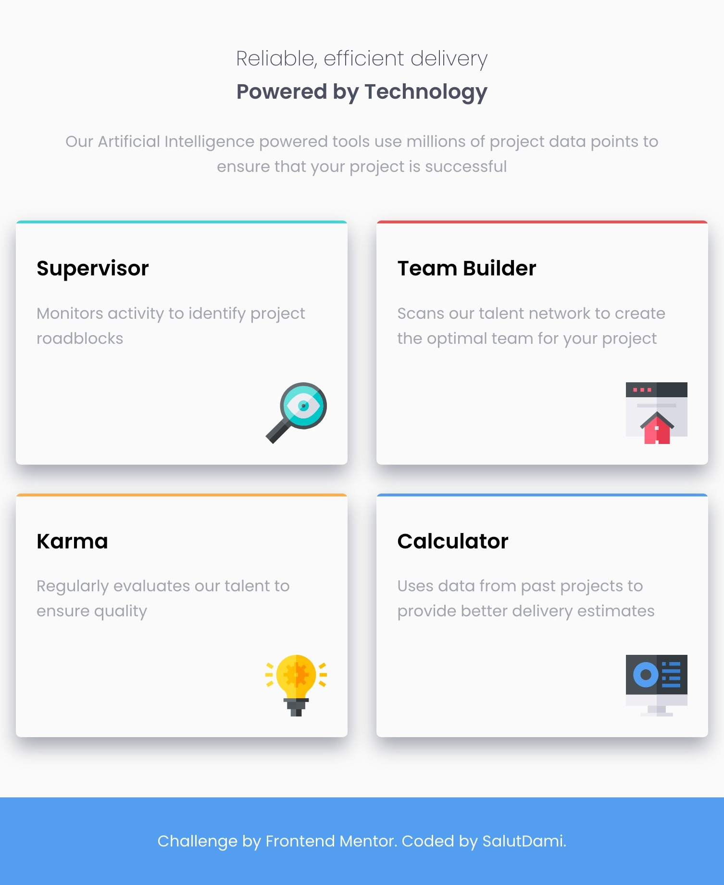
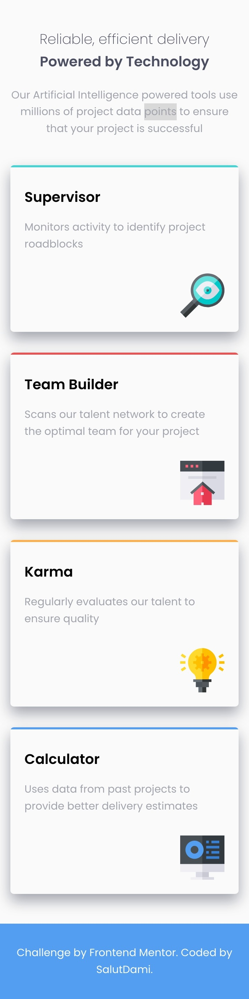

## Table of contents

- [Overview](#overview)
  - [The challenge](#the-challenge)
  - [Screenshot](#screenshot)
  - [Links](#links)
- [My process](#my-process)
  - [Built with](#built-with)
  - [What I learned](#what-i-learned)
  - [Continued development](#continued-development)
  - [Useful resources](#useful-resources)
- [Author](#author)
- [Acknowledgments](#acknowledgments)

## Overview

### The challenge

This orject which was carried out will enable the users be able to have an optimal view of the layout at different viewports.

### Screenshot



_A screenshot showing the view on a desktop_



_A screenshot showing the view on a tablet_



_A screenshot showing the view on a mobile_

### Links

- Solution URL: [Add solution URL here](https://github.com/salutDami/four-card-feature)
- Live Site URL: [Add live site URL here](https://salutdami.github.io/four-card-feature/)

## My process

### Built with

- Semantic HTML5 markup
- CSS custom properties
- CSS Grid
- Mobile-first workflow

### What I learned

Made us of the pseudo elements before (::before) to make the lines on the lines on the cards. You cann see the snippets on how I did this below:

```html
<div class="feature_card supervisor">
  <h2 class="feature_title">Supervisor</h2>
  <p class="feature_description">
    Monitors activity to identify project roadblocks
  </p>
  
</div>
```

```css
.feature_card {
  box-shadow: var(--shadow-1);
  border-radius: var(--radius-1);
  padding-top: var(--space-6);
  padding-bottom: var(--space-5);
  padding-left: var(--space-5);
  padding-right: var(--space-5);
}

.supervisor,
.team,
.karma,
.calculator {
  position: relative;
  overflow: hidden;
}

.supervisor::before {
  content: "";
  display: inline-block;
  position: absolute;
  background-color: var(--cyan);
  top: 0;
  left: 0;
  width: 100%;
  height: 3px;
}
```

### Continued development

I will keep doing more projects in the future to test my css and html skills.

## Author

- Twitter - [@\_salutDami](https://www.twitter.com/_salutDami)
- Linkedin- [Ikuomola Stephen](https://www.linkedin.com/in/ikuomola-stephen/)
- Frontend Mentor - [@salutDami](https://www.frontendmentor.io/profile/salutDami)
